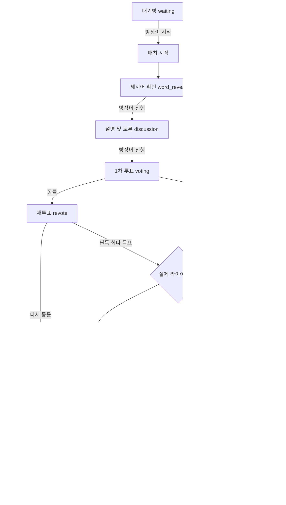

# 라이어 게임 기획 문서

## 0. 문서 목적

이 문서는 minigamebox에 추가하는 라이어 게임의 MVP 규칙과 구현 기준을 정의한다.

라이어 게임은 목표 점수 기반 다중 라운드 매치로 진행한다. 기존 마피아 게임의 방, 참가자, 인증, 채팅 기반은 재사용하되, 라이어 게임 상태와 비밀 정보는 전용 구조로 분리한다.

기존 프로젝트 구조 분석은 `docs/liar-game-analysis.md`, 구현 진행 상황과 배포 순서는 `docs/liar-game-go.md`를 참고한다.

## 1. 게임 개요

라이어 게임은 같은 제시어를 받은 일반 유저들과 제시어를 받지 못한 라이어가 설명과 토론을 진행하는 심리 게임이다.

| 개념 | 의미 |
| --- | --- |
| 매치: `match` | 대기방에서 시작해 최종 우승자가 결정될 때까지 이어지는 전체 게임 |
| 라운드: `round` | 제시어 확인, 토론, 투표, 추측, 점수 반영으로 구성되는 한 판 |
| 점수: `score` | 매치 안에서 참가자별로 누적되는 점수 |

한 라운드는 한 번의 토론과 투표로 끝난다. 라운드 결과에 따라 점수를 누적하고, 한 명 이상이 목표 점수에 도달하면 매치를 종료한다.

### 1.1 라운드별 초기화

매 라운드 시작 시 다음 데이터를 새로 생성한다.

- 라이어 1명
- 제시어 1개
- 라운드 역할 상태
- 1차 투표 기록
- 재투표 기록
- 라이어 최종 추측 기록

라이어는 매치 시작 시 한 번만 정하는 역할이 아니다. 매 라운드 완전 무작위로 다시 선정한다. MVP에서는 같은 참가자가 연속으로 라이어가 될 수 있다.

## 2. 참가 조건

| 항목 | MVP 규칙 |
| --- | --- |
| 최소 시작 인원 | 3명 |
| 최대 인원 | 12명 |
| 라이어 수 | 매 라운드 1명 고정 |
| 일반 유저 수 | 매치 참가자 수 - 1 |
| 관전 | 제공하지 않음 |

매치 시작 시점의 참가자를 스냅샷으로 고정한다. 매치 진행 중에는 신규 참가, 강퇴, 준비 상태 변경을 허용하지 않는다.

### 2.1 매치 시작 조건

1. 방 상태가 `waiting`이다.
2. 요청자가 방장이다.
3. 활성 참가자가 3명 이상이다.
4. 활성 참가자 전원이 준비 완료 상태다.
5. 같은 방에 진행 중인 게임이 없다.
6. 선택 가능한 활성 제시어가 최소 1개 이상 존재한다.
7. 라이어 게임 설정값이 서버 검증을 통과한다.

### 2.2 연결 해제와 재접속

- 연결이 끊긴 참가자도 매치 스냅샷에서 제거하지 않는다.
- 재접속한 참가자는 현재 라운드, 자신의 역할, 누적 점수, 공개 투표 현황을 다시 조회한다.
- 연결 해제 참가자를 다음 라운드 배정에서 제외하는 기능은 MVP 이후에 검토한다.

## 3. 설정 모드

라이어 게임 설정은 `classic`, `custom` 두 모드로 나눈다.

### 3.1 클래식: `classic`

클래식은 빠르게 시작하기 위한 기본 규칙이다.

| 설정 | 값 |
| --- | --- |
| `target_score` | 5 |
| `citizen_win_score` | 1 |
| `liar_win_score` | 2 |
| `liar_count` | 1 |
| `tie_rule` | `revote` |
| `self_vote_allowed` | `false` |
| `liar_word_mode` | `none` |

클래식에서도 테마는 선택할 수 있다. 클래식은 점수와 규칙을 고정하는 모드이며 테마를 고정하는 모드가 아니다.

### 3.2 커스텀: `custom`

| 설정 | 추천 UI 선택지 | 서버 검증 범위 |
| --- | --- | --- |
| 테마: `category_id` | 랜덤 또는 활성 테마 | `null` 또는 활성 카테고리 ID |
| 목표 점수: `target_score` | 3, 5, 7, 10 | 3~20 |
| 시민 승리 점수: `citizen_win_score` | 1, 2 | 1~5 |
| 라이어 승리 점수: `liar_win_score` | 2, 3, 5 | 1~10 |

커스텀 MVP에서도 다음 값은 고정한다.

- `liar_count = 1`
- `tie_rule = 'revote'`
- `self_vote_allowed = false`
- `liar_word_mode = 'none'`

### 3.3 테마 선택

- `category_id = null`이면 모든 활성 테마에서 무작위로 선택한다.
- `category_id`가 지정되면 해당 테마의 활성 제시어만 사용한다.
- 비활성 테마와 비활성 제시어는 선택하지 않는다.

MVP 기본 테마:

- 음식
- 동물
- 장소
- 물건
- 직업
- 스포츠

## 4. 매치 및 라운드 흐름



MVP에서는 자동 타이머 대신 방장이 주요 단계를 진행한다. 자동 타이머와 비정상 종료 복구는 후속 범위다.

## 5. 라운드 단계

| 단계 | 의미 | 다음 단계 |
| --- | --- | --- |
| `word_reveal` | 내 역할과 제시어 확인 | `discussion` |
| `discussion` | 공개 채팅으로 설명과 토론 | `voting` |
| `voting` | 1차 공개 투표 | `revote`, `liar_guess`, `round_result` |
| `revote` | 동률 후보만 대상으로 재투표 | `liar_guess`, `round_result` |
| `liar_guess` | 지목된 라이어가 제시어를 한 번 추측 | `round_result` |
| `round_result` | 라운드 결과와 점수 변화 공개 | 다음 `word_reveal`, `match_result` |
| `match_result` | 최종 우승자와 점수 공개 | 대기방 |

### 5.1 역할 확인: `word_reveal`

| 역할 | 표시 정보 |
| --- | --- |
| 일반 유저: `citizen` | 역할, 테마, 제시어 |
| 라이어: `liar` | 역할, 테마, 제시어를 받지 못했다는 안내 |

### 5.2 토론: `discussion`

- 모든 참가자는 공개 게임 채팅을 사용한다.
- 일반 유저는 제시어를 직접 말하지 않고 특징을 설명한다.
- 라이어는 다른 참가자의 설명을 바탕으로 정체를 숨긴다.
- 서버는 라이어 방의 일반 채팅 저장을 `discussion` 단계에서만 허용한다.

### 5.3 1차 투표: `voting`

- 모든 참가자는 자기 자신을 제외한 참가자 한 명에게 투표한다.
- 투표 후 변경할 수 없다.
- 누가 누구에게 투표했는지 즉시 공개한다.
- 참가자 전원이 투표하면 결과를 판정한다.

### 5.4 재투표: `revote`

1차 투표의 최다 득표자가 여러 명이면 재투표를 진행한다.

- 모든 참가자가 다시 투표한다.
- 1차 투표의 공동 최다 득표자만 후보가 된다.
- 재투표 후에는 변경할 수 없다.
- 재투표에서도 동률이면 라운드를 무효 처리한다.

### 5.5 라이어 최종 추측: `liar_guess`

실제 라이어가 단독 지목되면 라이어에게 한 번의 제시어 추측 기회를 준다.

- 라이어 한 명만 입력할 수 있다.
- 앞뒤 공백을 제거한다.
- 연속 공백은 하나로 줄인다.
- 영문은 대소문자를 구분하지 않는다.
- MVP에서는 동의어, 별칭, 오타를 정답으로 인정하지 않는다.

## 6. 점수 및 승패

### 6.1 라운드 점수

| 상황 | 처리 |
| --- | --- |
| 일반 유저 승리 | 일반 유저 전원에게 `citizen_win_score` 지급 |
| 라이어 승리 | 해당 라이어에게 `liar_win_score` 지급 |
| 재투표도 동률 | `invalid`, 점수 지급 없음 |

기본값은 시민 승리 `+1점`, 라이어 승리 `+2점`이다.

### 6.2 라운드 판정표

| 상황 | 결과 | 사유 코드 |
| --- | --- | --- |
| 단독 지목자가 실제 라이어가 아님 | `liar` | `wrong_player_voted` |
| 실제 라이어가 제시어를 맞힘 | `liar` | `liar_guessed_word` |
| 실제 라이어가 제시어를 틀림 | `citizen` | `liar_failed_guess` |
| 재투표에서도 동률 | `invalid` | `revote_tied` |

### 6.3 매치 종료

라운드 점수를 반영한 직후 참가자별 누적 점수를 검사한다.

| 상황 | 처리 |
| --- | --- |
| 목표 점수 도달자가 없음 | 다음 라운드 시작 |
| 목표 점수 도달자가 한 명 | 해당 참가자 우승 |
| 목표 점수 도달자가 여러 명 | 도달자 중 최고 점수 참가자 우승 |
| 최고 점수 참가자가 여러 명 | 공동 우승 |

예시:

- 목표 5점, A 5점, B 4점: A 우승
- 목표 5점, A 6점, B 5점: A 우승
- 목표 5점, A 5점, B 5점: A와 B 공동 우승

## 7. 투표 공개 규칙

투표는 `voting`, `revote` 단계에서 실시간 공개한다.

### 7.1 시스템 메시지

예시:

```text
[시스템] 박성훈님이 김철수님에게 투표했습니다.
[시스템] 재투표: 이영희님이 박성훈님에게 투표했습니다.
```

MVP 구현은 시스템 메시지를 `game_messages`에 저장한다.

### 7.2 투표 현황 패널

후보 기준으로 득표 수와 투표자를 표시한다.

```text
김철수 2표
- 박성훈
- 이영희

대기 중
- 최민수
```

재투표 단계에서는 재투표 후보만 선택 가능하게 표시한다.

## 8. 화면 구성

### 8.1 메인 로비

- 라이어 게임 카드
- `rooms.game_type = 'liar'` 방 목록
- 라이어 방 생성 버튼
- 공개방과 비공개방 입장

### 8.2 방 생성과 대기방

공통 표시:

- 공개방 또는 비공개방
- 참가 인원
- `classic`, `custom` 선택
- 랜덤 또는 특정 테마
- 참가자 목록과 준비 상태
- 대기방 Broadcast 채팅

커스텀 추가 표시:

- 목표 점수
- 시민 승리 점수
- 라이어 승리 점수

### 8.3 플레이 화면

- 현재 라운드 번호
- 목표 점수
- 현재 단계
- 내 역할과 제시어 카드
- 참가자별 누적 점수판
- 공개 게임 채팅
- 투표 후보
- 실시간 투표 현황
- 방장 단계 진행 버튼

### 8.4 결과 화면

라운드 결과:

- 라이어
- 테마와 제시어
- 지목 결과
- 라이어 추측
- 라운드 승패 또는 무효 사유
- 점수 변화와 누적 점수

최종 결과:

- 최종 우승자 또는 공동 우승자
- 최종 점수판
- 총 라운드 수
- 대기방 복귀 버튼

## 9. 상태 구조

### 9.1 공통 상태

`rooms.status`:

- `waiting`
- `starting`
- `playing`
- `game_over`

`games.status`:

- `playing`
- `ended`
- `finished`

라이어 게임에서 `games`는 개별 라운드가 아니라 전체 매치를 나타낸다.

### 9.2 라이어 전용 상태

```text
rooms
  -> games                  전체 매치
    -> liar_match_states    공개 매치 설정과 현재 라운드
    -> liar_match_players   참가자 스냅샷
    -> liar_scores          누적 점수
    -> liar_rounds          공개 라운드 상태
      -> liar_votes         공개 투표
      -> liar_round_secrets 비공개 라이어와 제시어
      -> liar_guesses       비공개 추측 원문
```

## 10. DB 설계

### 10.1 공개 테이블

| 테이블 | 용도 |
| --- | --- |
| `public.liar_categories` | 활성 테마 목록 |
| `public.liar_room_settings` | 방별 `classic`, `custom` 설정 |
| `public.liar_match_states` | 목표 점수, 점수 규칙, 현재 라운드, 최종 우승자 |
| `public.liar_match_players` | 매치 참가자 스냅샷 |
| `public.liar_scores` | 참가자별 누적 점수 |
| `public.liar_rounds` | 공개 가능한 라운드 단계와 결과 |
| `public.liar_votes` | 실시간 공개 투표 |

### 10.2 비공개 테이블

| 테이블 | 용도 |
| --- | --- |
| `private.liar_words` | 제시어 원본과 정규화 값 |
| `private.liar_round_secrets` | 라운드별 실제 라이어와 제시어 |
| `private.liar_guesses` | 라이어 최종 추측 원문과 정답 여부 |

### 10.3 투표 제약

`public.liar_votes`의 유일 제약:

```text
(round_id, voter_id, vote_attempt_no)
```

- `vote_attempt_no = 1`: 1차 투표
- `vote_attempt_no = 2`: 재투표
- 한 참가자는 각 투표 시도마다 한 번만 투표 가능
- 자기 자신에게 투표 불가

## 11. RPC 설계

| RPC | 역할 |
| --- | --- |
| `configure_liar_room` | 방 설정 저장과 서버 검증 |
| `start_liar_match` | 참가자 스냅샷, 점수 초기화, 첫 라운드 시작 |
| `get_current_liar_match` | 공개 매치 상태, 현재 라운드, 점수판, 투표 현황 조회 |
| `get_my_liar_state` | 현재 사용자의 역할과 허용된 제시어 조회 |
| `submit_liar_vote` | 단계와 후보 검증 후 1회 투표 저장 |
| `resolve_liar_vote` | 투표 집계, 재투표 진입, 지목 결과 처리 |
| `submit_liar_guess` | 라이어 1회 추측과 라운드 결과 처리 |
| `advance_liar_phase` | 방장의 수동 단계 진행 |
| `return_liar_room_to_lobby` | 최종 결과 이후 대기방 초기화 |

## 12. 보안 규칙

- 실제 라이어 ID와 제시어는 `private` 스키마에 저장한다.
- 결과 단계 전까지 실제 라이어를 다른 참가자에게 노출하지 않는다.
- 결과 단계 전까지 라이어에게 제시어를 노출하지 않는다.
- 각 사용자는 `get_my_liar_state`를 통해 자신의 정보만 조회한다.
- 공개 테이블은 RLS를 활성화하고 매치 참가자만 조회하도록 제한한다.
- 공개 투표 테이블은 브라우저에서 직접 쓰지 못하게 하고 RPC로만 저장한다.
- Realtime publication에는 공개 상태 테이블만 추가한다.
- 라이어 방의 일반 게임 채팅은 서버 트리거로 `discussion` 단계에서만 허용한다.
- 공개 RPC는 `security invoker` 래퍼로 두고, 권한 상승 구현은 `private` 스키마에 둔다.

## 13. MVP 범위

### 13.1 포함

- 3명 이상 12명 이하
- 목표 점수 기반 다중 라운드
- 라운드마다 라이어와 제시어 무작위 재선정
- 클래식과 커스텀 설정
- 클래식에서도 테마 선택
- 시민과 라이어 승리 점수 분리
- 공개방과 비공개방
- 대기방 준비 상태와 채팅
- 역할 및 제시어 확인
- 토론 단계 게임 채팅
- 투표 실시간 공개
- 투표 후 변경 불가
- 동률 시 후보 제한 재투표
- 재투표 동률 시 라운드 무효
- 라이어 최종 추측
- 점수판과 최종 우승자
- 결과 단계 전 비밀 정보 보호

### 13.2 추후 확장

- 자동 타이머와 Cron 기반 단계 진행
- 연결 해제 참가자 처리 정책
- 라이어 2명 이상
- 연속 라이어 방지 옵션
- 최근 제시어 중복 방지
- 유사 제시어 모드
- 발언 순서 강제
- 무제한 재투표
- 투표 비공개 또는 변경 가능 모드
- 전적, 랭킹, 경험치, 코인 보상
- 관리자 제시어 관리
- 사용자 커스텀 제시어
- 관전

## 14. MVP 완료 기준

1. 라이어 게임 카드에서 방을 생성할 수 있다.
2. 라이어 게임은 3명 이상, 전원 준비 상태에서만 시작한다.
3. 클래식은 서버가 목표 5점, 시민 +1점, 라이어 +2점으로 강제한다.
4. 커스텀은 테마와 점수를 서버 범위 안에서 저장한다.
5. 매 라운드 라이어와 제시어를 다시 무작위 선정한다.
6. 일반 유저는 제시어를 확인하고 라이어는 제시어를 볼 수 없다.
7. 게임 채팅은 토론 단계에서만 저장된다.
8. 투표는 즉시 공개되고 제출 후 변경할 수 없다.
9. 1차 동률이면 재투표 후보만 대상으로 다시 투표한다.
10. 재투표도 동률이면 점수 없이 다음 라운드로 이동한다.
11. 라이어 지목 성공 시 라이어에게 한 번의 추측 기회를 준다.
12. 라운드 결과에 따라 설정된 점수를 누적한다.
13. 목표 점수 도달자 중 최고 점수 참가자를 최종 우승자로 처리한다.
14. 최고 점수 참가자가 여러 명이면 공동 우승으로 표시한다.
15. 공개 Data API와 Realtime payload로 비밀 정보가 노출되지 않는다.

## 15. 구현 Issue 순서

1. 기존 프로젝트 구조 분석
2. 라이어 게임 기획 문서 보완
3. 제시어 카테고리와 단어 DB 설계
4. 매치, 라운드, 점수, 투표 DB 설계
5. 클래식과 커스텀 설정 저장 구조
6. 라이어 매치 시작 RPC
7. 라운드 시작 RPC
8. 내 역할과 제시어 조회 RPC
9. 투표 제출 RPC
10. 투표 현황 조회
11. 투표 판정과 재투표 처리 RPC
12. 라이어 최종 추측 RPC
13. 점수 지급과 매치 종료 처리
14. 게임 타입별 라우팅
15. 라이어 대기방
16. 라이어 플레이 화면
17. 실시간 투표 패널과 시스템 메시지
18. RLS와 비밀 정보 노출 검토
19. 라이브 Supabase 적용과 브라우저 시나리오 테스트
